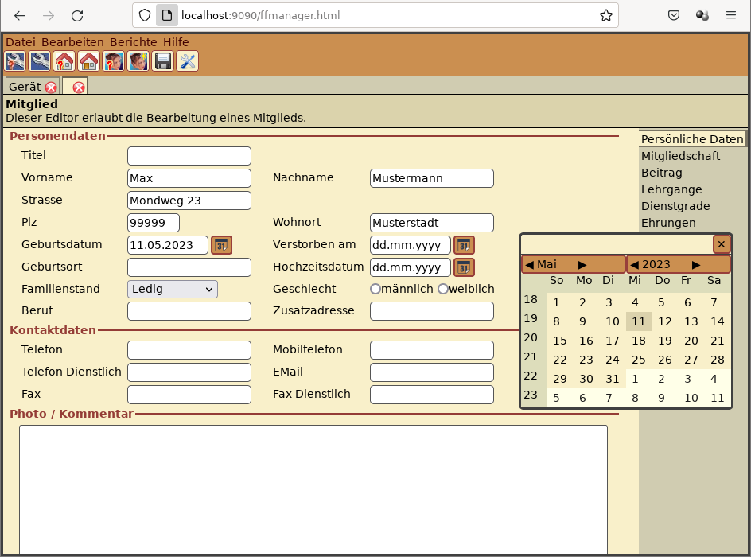
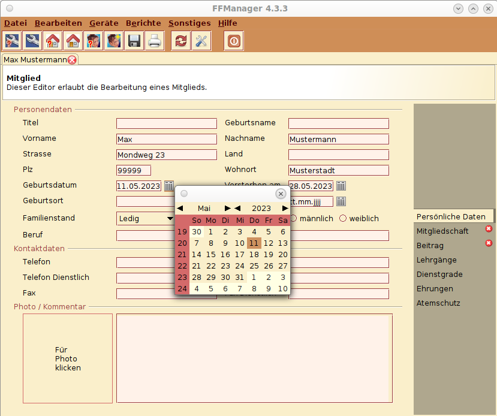

# GWTSwing
This is an UI API similar to Java's Swing API, but on top of Java to Web transpilers like GWT and TeaVM. 
Even though, the name is still GWTSwing, it has been ported to TeaVM by introducing a platform abstraction layer named
gplatform, with implementations for GWT and TeaVM.

There are 2 main differences between Swing an GWTSwing.
1. Modal dialogs don't stop event execution. Instead of that, callback objects can be used, to get notified if a dialog was closed.
2. All Classnames beginn with "G" instead of "J" (GTextField instead of JTextField). This was done to avoid license problems, because the API is now different from Oracles Swing and to avoid confusion while developing with GWTSwing.

There are no server calls after starting the application. Everything is handled locally on the client.

## What's new
### 2024-03-17 Version 1.2
GWTSwing can now dynamically switch between different Stylesheets. To see that in action just have a look at the demos listed below. Inside the demo select "Look" on the left, and then press one of the available style buttons like "Dark" for the Dark Mode.

## How to use
### GWT
GWTSwing is used like other gwt libraries. Just add the gwtswing, gplatform and gplatform.gwt to your classpath and

```
  <inherits name='de.exware.gwtswing'/>
```
to your projects ```abc.gwt.xml```.
Additionally you should add the css file to your html pages header
```
   <link type="text/css" rel="stylesheet" href="YOUR_PROJECT_NAME/de/exware/gwtswing/gwtswing.css">
```

After that, you can use the GWTSwing classes in your project.

```
GPanel panel = new GPanel();
panel.setLayout(new GGridLayout(1, 1));
GLabel label = new GLabel("Hello World");
panel.add(label);
panel.setSize(800,600);
GUtilities.addToBody(panel);
```
Looks like Swing? Thats the goal! :-) 

The call of 'GUtilities.addToBody' appends your GWTSwing UI to the Web Page.

Porting an existing Swing application is now nearly as easy as replacing all "J" with "G".

### TeaVM
To use GWTSwing with teavm you need the contents of the following
repositories: gplatform.teavm, gplatform and of course gwtswing.

For each of them call 

```
sh nobuto.sh -t installToMaven -vvv
```
to add them to your local maven repository.
Then include the gplatform.teavm and gwtswing as dependencies in your project. 

```
<dependency>
  <groupId>de.exware</groupId>
  <artifactId>de.exware.gplatform.teavm</artifactId>
  <version>1.0</version>
</dependency>
<dependency>
  <groupId>de.exware</groupId>
  <artifactId>de.exware.gwtswing</artifactId>
  <version>1.0</version>
</dependency>
```

Furthermore you need to include the contents of the resources folder in the webapp folder. 

You have to manually link the css file with: 

```
<link href="./de/exware/gwtswing/gwtswing.css" rel="stylesheet">
```
Now you need to initialize the TeavmGPPlatform class with a static call to the init method.

```java
public static void main(String[] args) 
{
    TeavmGPlatform.init();
    ...
}
```

After that you are good to go and use the G classes of gwtswing.

## Demo
A small demo application, which shows some of the main UI components can be found here:

with GWT:   http://www.exware.de/gwtswing/demo/gwt/demo.html

with TeaVM: http://www.exware.de/gwtswing/demo/teavm/demo.html

## Real live usage
Where is GWTSwing used

### keedo
An archive system for digital documents which allows to set markers on documents without modifying the original documents. Includes an automatic text recognition system (OCR) for scanned documents. A demo can be found on the projects homepage. https://keeitsi.com/

### Keeitsi homepage
The companies homepage was made with GWTSwing just to prove, that it is possible.

### FFManager
FFManager is an application to manage volunteer fire brigades. In it's newest release 4.x the developers began to port the Swing UI to GWTSwing.
This looks like 
<br>

<br>compared to the original swing application:
<br>

